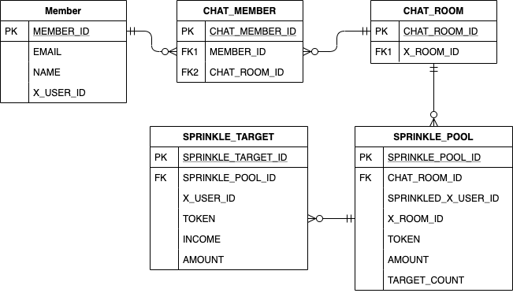

# 카카오페이 뿌리기 기능 구현하기

## Environmnet

* JAVA 8
* Spring Boot 2.3.1.RELEASE
* MySQL
* Gradle
* Junit5

### Dependency

* Spring data JPA
* lombok
* [jnanoid](https://github.com/aventrix/jnanoid)

### ERD

### 기능구현

- 뿌리기
  - /api/sprinkleMoney
